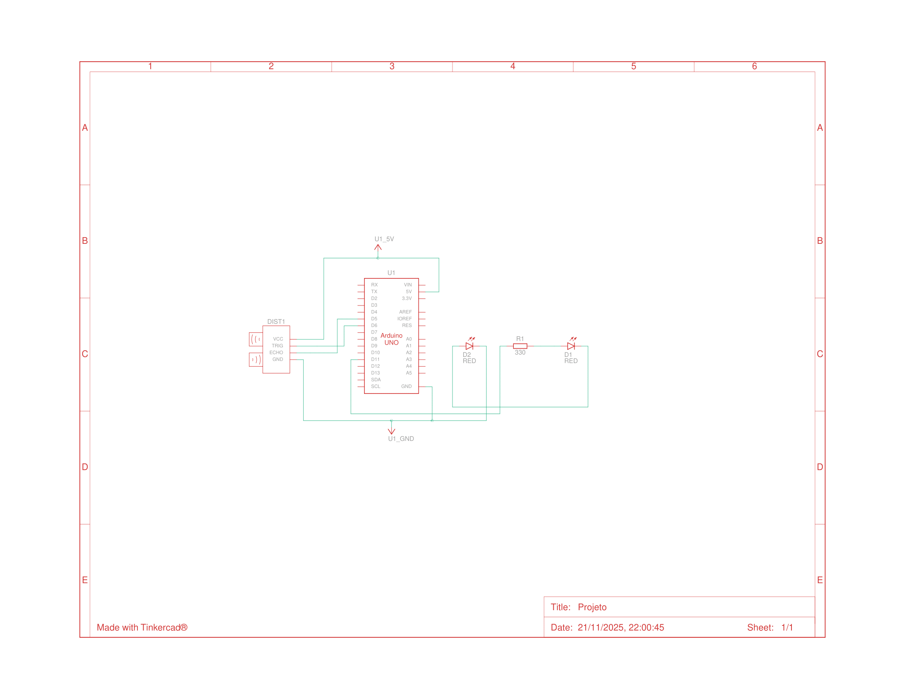
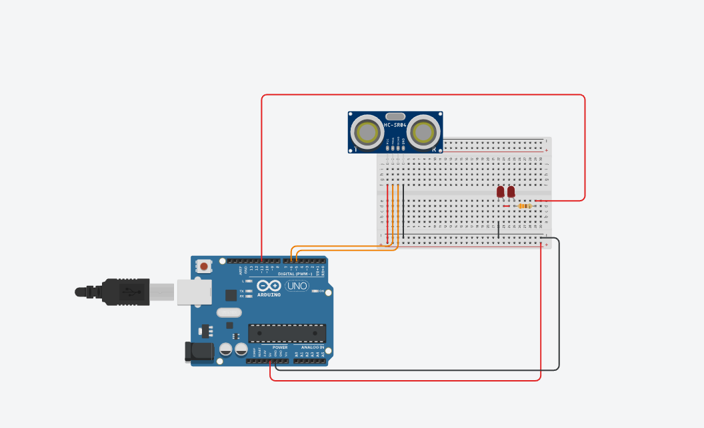
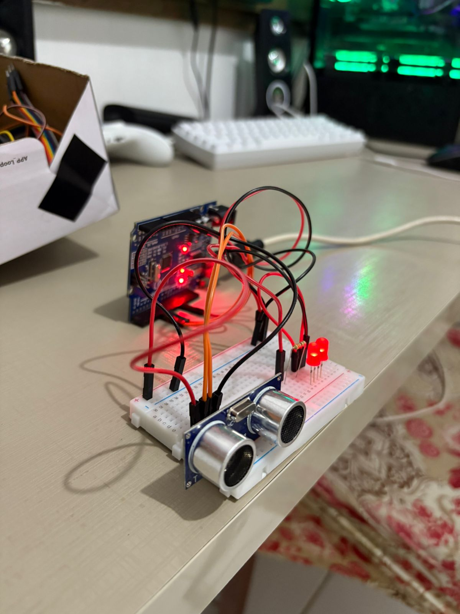
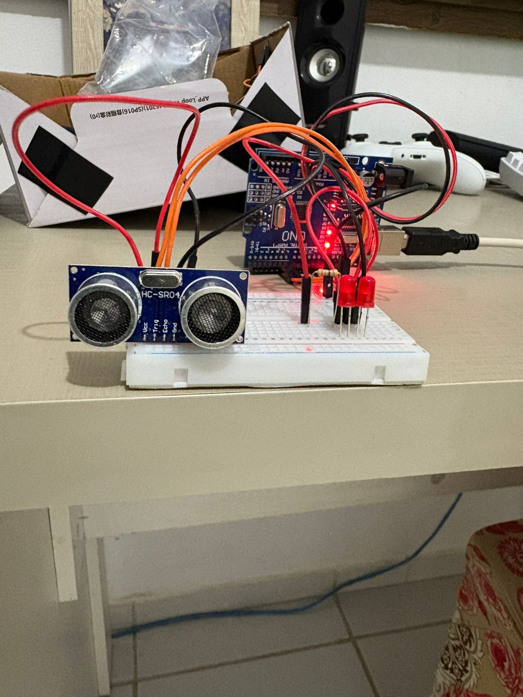
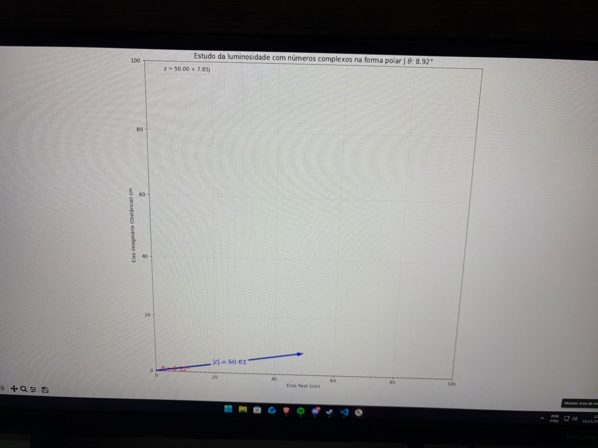
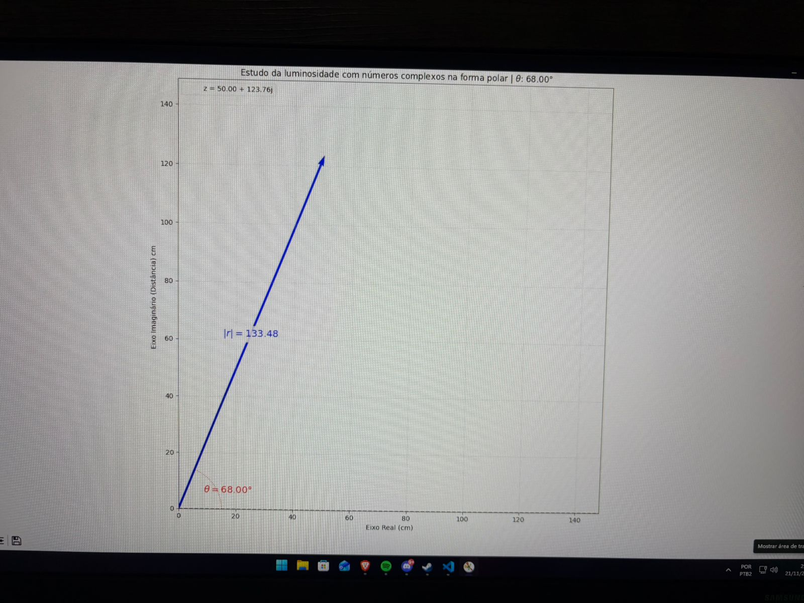

# ⚛️ Visualizador de Números Complexos em Forma Polar (Arduino + Python)

* Este projeto foi desenvolvido como parte complementar da terceira nota da disciplina de **Variáveis Complexas** no curso de Engenharia da Computação na Universidade Estadual do Maranhão (**UEMA**).
* A proposta é **facilitar a visualização** de números complexos na forma polar. O projeto utiliza um **sensor ultrassônico HC-SR04** e LEDs vermelhos indicadores.
* **Lógica de Intensidade:** A intensidade dos LEDs varia em função do ângulo ($\theta$): eles **aumentam a intensidade** à medida que o vetor tende ao **eixo imaginário** ($\theta = \frac{\pi}{2}$) e **diminuem** (tendendo a se apagar) à medida que o vetor se aproxima do **eixo real** ($\theta = 0$ ou $\theta = \pi$).
* O hardware inclui um **Arduino Uno**. O software utiliza **Python** com as bibliotecas `pyserial` para comunicação serial e `matplotlib` para manipulação e criação gráfica interativa.

---

## 🛠️ Esquema e Construção

| Esquema Eletrônico | Construção Física |
| :---: | :---: |
|  |  |

---

## 💻 Como Utilizar

Primeiramente, clone este repositório do GitHub para o seu computador.

```bash
git clone [https://github.com/JulioCesra/numeros-complexos-com-arduino-uno.git](https://github.com/JulioCesra/numeros-complexos-com-arduino-uno.git)
```
Em seguida, baixe as bibliotecas Python necessárias:
```bash
pip install matplotlib pyserial numpy
```
No terminal de sua preferência (após configurar a porta serial correta no código Arduino/Python), execute o código principal:
```bash
python .\numeros-complexos-arduino.py
```

## 🎥 Demonstração

| Tipo de Mídia | Visualização |
| :---: | :---: |
| **Fotos da Construção** |    |
| **Gráfico (Exemplo 1)** |  |


| **Gráfico (Exemplo 2)** |  |

| **Vídeo do Projeto** |    |


## 🧑‍💻 Autor

- [@JulioCesra](https://www.github.com/JulioCesra)

